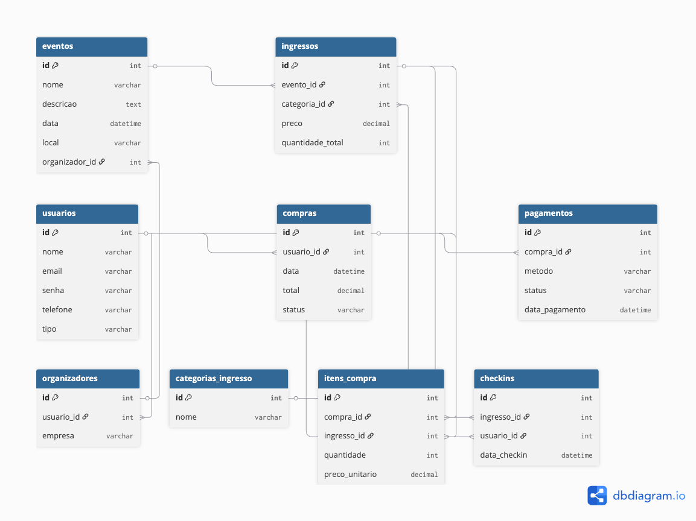
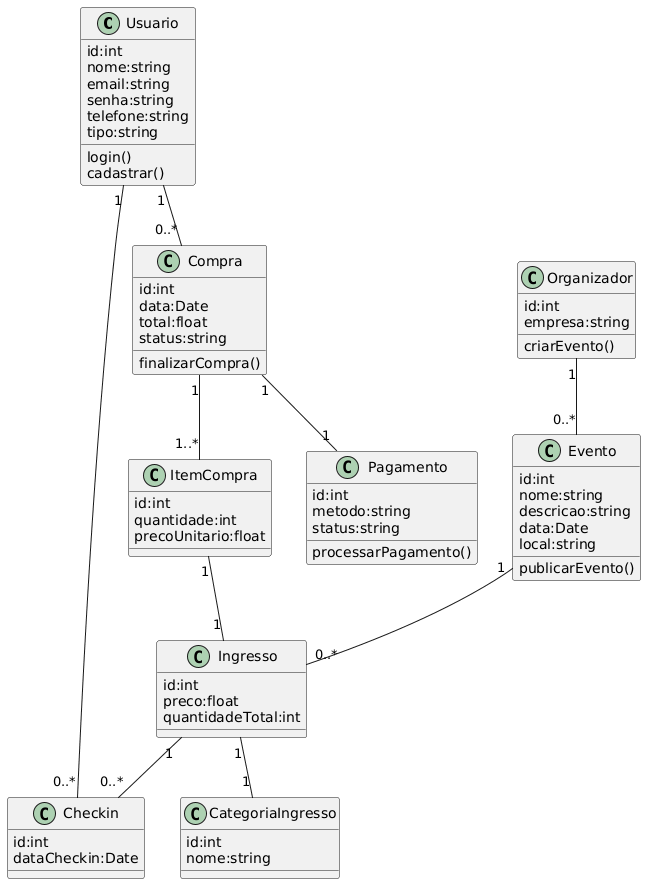
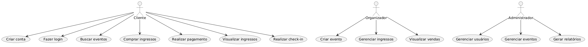
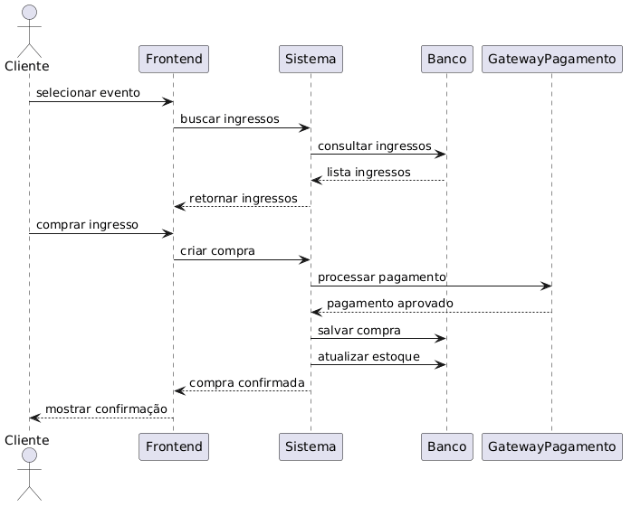
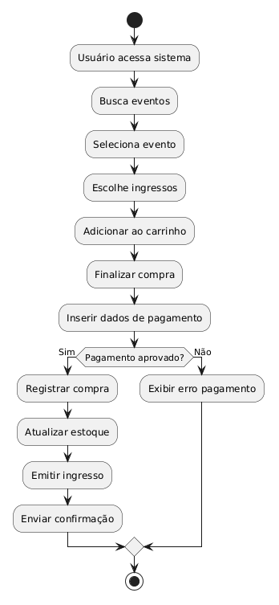

# Sistema de Gestão de Eventos

Projeto desenvolvido para a disciplina **Práticas Extensionistas III**.

## Modelagem do Sistema

### Diagrama Entidade-Relacionamento

### Diagrama de Classes

### Diagrama de Caso de Uso

### Diagrama de Sequência

### Diagrama de Atividades

